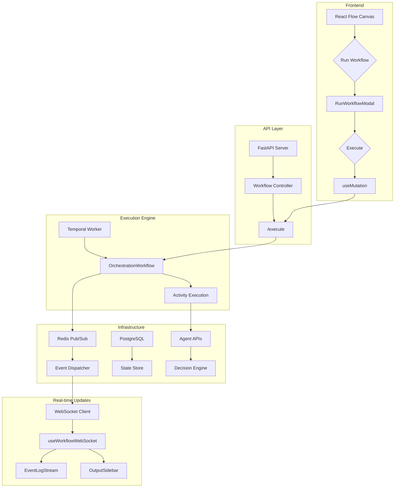

<div align="center">

# 🎯 Agentic Orchestration Builder

### Visual, Event-Driven AI Workflow Orchestration Platform

[](https://lyzr-alpha.vercel.app/)
[](https://github.com/sandip-pathe/lyzr)

**Built in 6 days** | Complex AI workflows that feel like magic ✨

[Features](#-key-features) • [Architecture](#-architecture) • [Quick Start](#-quick-start) • [Tech Stack](#-tech-stack) • [Demo](#-live-demo)

</div>


## 🎬 Live Demo

**🌐 Try it now:** [lyzr-alpha.vercel.app](https://lyzr-alpha.vercel.app/)

> Experience the full power of hybrid AI-agentic orchestration with our live deployment. Build, execute, and monitor complex workflows in real-time.


## 💡 The Problem & Our Solution

### ⚠️ The Challenge
Existing workflow tools (Airflow, n8n, Zapier) are built for **predictable, deterministic tasks**. They fail when dealing with the **non-deterministic, adaptive nature** of modern AI agents.

### ✨ Our Approach
A **hybrid orchestrator** combining:
- ✅ **Reliability** of deterministic workflow engines (Temporal)
- ⚡ **Flexibility** of event-driven architecture (Redis Pub/Sub)
- 🎯 **Single, auditable workflow** for both traditional logic and intelligent AI agents

### 🏆 The Result
A full-stack platform that orchestrates **both deterministic and non-deterministic AI workflows** with:
- 🎨 Visual canvas for workflow design
- 🤖 Multi-model AI agent support
- 👤 Human-in-the-loop approval steps
- 📊 Real-time state management
- 🔍 Complete observability


## 🏗️ Architecture

### System Overview




### 🔄 Data Flow

```
User Design → FastAPI → Temporal → AI Agent → Redis Event → WebSocket → Real-time UI Update
```

1. **Design:** Visual workflow creation on React Flow canvas
2. **Execute:** Workflow sent to FastAPI backend with input data
3. **Orchestrate:** Temporal creates durable execution instance
4. **Process:** Worker executes AI Agent nodes (GPT-4o, Lyzr, custom agents)
5. **Event:** Task completion published to Redis Pub/Sub
6. **Monitor:** Frontend receives WebSocket events, updates canvas in real-time
7. **HITL:** Workflow pauses for human approval when needed
8. **Resume:** Approved workflows continue to completion


## ✨ Key Features


### 🎨 Visual Builder
Drag-and-drop canvas powered by **React Flow** for intuitive workflow design

### 🔀 Hybrid Orchestration
Seamlessly blend deterministic nodes (HTTP, timers) with non-deterministic AI agents

### 👥 Human-in-the-Loop
Pause workflows for critical approvals via Slack, email, or web interface

</td>
<td width="50%">

### 📊 Real-time Monitoring
Live event streaming via WebSockets with complete execution visibility

### 📈 Agent Metrics
Track performance, latency, reliability, and cost per execution

### 💾 Durable Execution
Temporal-powered stateful workflows with full auditability and replay capability

</td>
</tr>
</table>


## 🛠️ Tech Stack

### Frontend


### Backend


### AI & Infrastructure


**Optimized for:** Reliability • Composability • Low Latency


## 🚀 Vision Beyond the Hackathon

This prototype is the foundation for a **no-code orchestration layer for enterprise AI workflows**.

### Roadmap
- 🏢 **Multi-tenant Architecture:** Isolation and security for enterprise deployments
- 📚 **Version Control:** Git-like workflow versioning and rollback
- 🎨 **Template Library:** Pre-built agent workflows for common business processes
- 🔌 **Plugin Ecosystem:** Community-contributed nodes and integrations
- 🌐 **Global Deployment:** Edge execution for latency-sensitive workflows

**Think:** Zapier meets LangChain, with enterprise-grade auditability and durability.


## 🚀 Quick Start

### Prerequisites
- Docker & Docker Compose
- Node.js 18+
- Python 3.11+

### Installation

```bash
# Clone the repository
git clone https://github.com/sandip-pathe/lyzr.git
cd lyzr

# Configure environment variables
cp .env.example .env
# Edit .env with your database, Redis, Temporal, and AI model credentials

# Launch the platform
docker-compose up --build
```

### Access Points

| Service | URL | Description |
|---------|-----|-------------|
| **Frontend** | `http://localhost:3000` | Visual workflow builder & dashboard |
| **Backend API** | `http://localhost:8000/docs` | Interactive API documentation |
| **Temporal UI** | `http://localhost:8088` | Workflow execution monitoring |


## 🎯 Why It's Different

> Every AI orchestration platform focuses on the **agents themselves**. We focus on the **coordination logic** — the missing layer between intelligence and execution.

### Our Unique Approach
- 🎯 **Agents as Components:** Treat AI agents as powerful but unpredictable units within a reliable framework
- 🔧 **Reliability First:** Deterministic orchestration for non-deterministic AI
- 📊 **Full Observability:** No black boxes — see every step, every decision
- 🏢 **Enterprise-Ready:** Auditability, durability, and compliance built-in


## 👨‍💻 Team & Credits

**Solo Build** by [Sandip Pathe](https://github.com/sandip-pathe)

Built in **6 days** with:
- ☕ Lots of coffee
- 🎵 Late-night coding sessions
- 💪 Passion for robust AI systems


## 📝 License

>© 2025 Sandip Pathe – All rights reserved. For evaluation and demonstration only.

---

<div align="center">

### ⭐ Star this repo if you find it useful!

**Built with ❤️ for the future of AI orchestration**

[](https://github.com/sandip-pathe/lyzr)
[](https://github.com/sandip-pathe/lyzr/fork)

[🚀 Live Demo](https://lyzr-alpha.vercel.app/) • [📖 Documentation](#) • [🐛 Report Bug](#) • [💡 Request Feature](#)

</div>